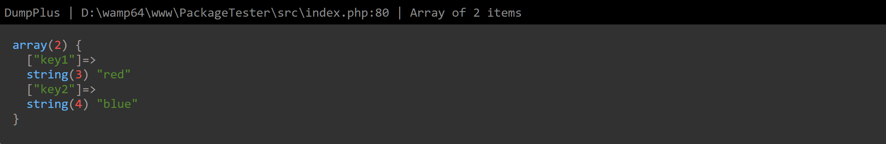
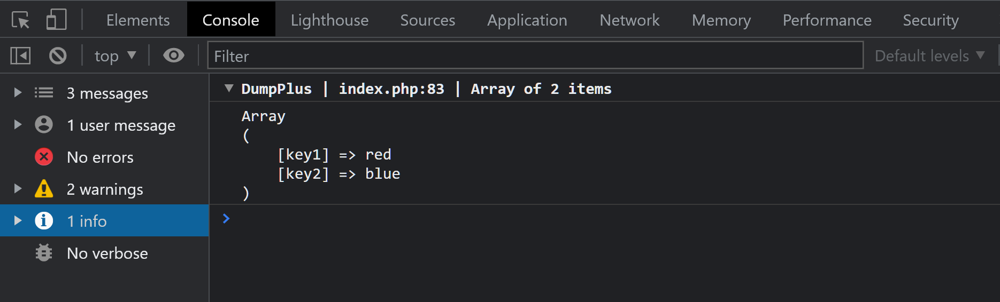
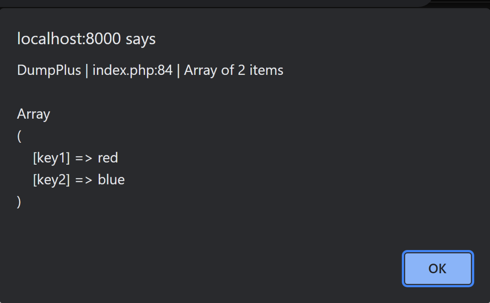

# Dump Plus

With DumpPlus, you can view the content of any variable or object in many different formats:

* syntax highlighting
* Browsers console log output
* Via Javascript alert() function
* Default var_dump() output
* Command-line interface output
* Simple format
* JSON format

## Installation
Use Composer to install the library:
```
$ composer require arashjafari/dump-plus
```

## Screenshots

Screenshot of DumpPlus::pretty($colors);


Screenshot of DumpPlus::console($colors); 


Screenshot of DumpPlus::alert($colors); 



## Example

```php

use ArashJafari\DumpPlus\DumpPlus;

// Sample array to dump
$colors = ['key1' => 'red', 'key2' => 'blue'];

// Default dump output
DumpPlus::dump($colors);

// Dump with syntax highlighting
DumpPlus::pretty($colors);

// Dump in simple format
DumpPlus::simple($colors);

// Dump for CLI output
DumpPlus::cli($colors);

// Dump in browser console
DumpPlus::console($colors);

// Dump in Javascript alert!
DumpPlus::alert($colors);

// Dump in JSON format
DumpPlus::json($colors);

```

Calling with multiple arguments:

```php
use ArashJafari\DumpPlus\DumpPlus;

$msg = "Hello World!";
$colors = ['key1' => 'red', 'key2' => 'blue'];
 
DumpPlus::dump($msg, $colors);
```

Calling with functions instead of DumpPlus methods:

```php

$colors = ['key1' => 'red', 'key2' => 'blue'];

dp($colors); // DumpPlus::dump($colors);
dpd($colors); // DumpPlus::dump($colors); die();

dp_pretty($colors); // DumpPlus::pretty($colors);
dpd_pretty($colors); // DumpPlus::pretty($colors); die();

dp_simple($colors); // DumpPlus::simple($colors);
dpd_simple($colors); // DumpPlus::simple($colors); die();

dp_cli($colors); // DumpPlus::cli($colors);
dpd_cli($colors); // DumpPlus::cli($colors); die();

dp_console($colors); // DumpPlus::console($colors);
dpd_console($colors); // DumpPlus::console($colors); die();

dp_alert($colors); // DumpPlus::alert($colors);
dpd_alert($colors); // DumpPlus::alert($colors); die();

dp_json($colors); // DumpPlus::json($colors);
dpd_json($colors); // DumpPlus::json($colors); die();
```

## License

The DumpPlus is open-sourced software licensed under the [MIT license](https://opensource.org/licenses/MIT).